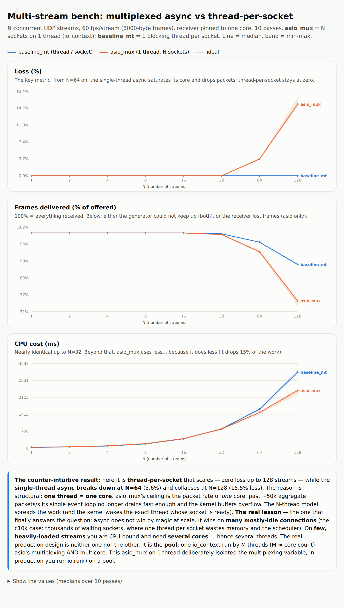
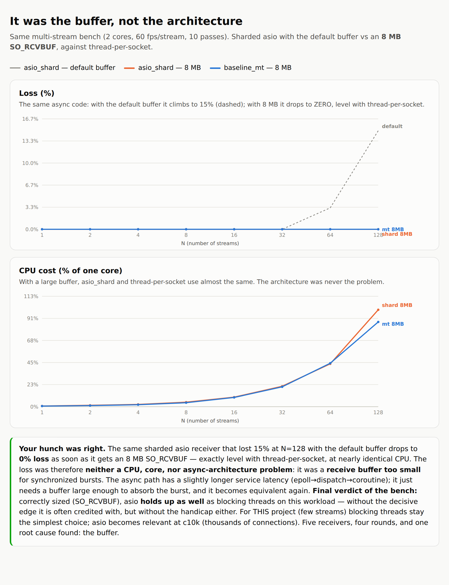

**English** · [Français](README.fr.md)

# ESP32-CAM → UDP → PC: real-time video pipeline + receiver bench


Real-time video stream: an **ESP32-CAM** captures JPEG and sends it over **UDP** to a PC
that **reassembles** it, measures telemetry (fps, loss, corruption, jitter), **displays**
it (OpenCV), and **upscales** it (adaptive classic upscaling). All of it capped off by a
**measured comparative study of receivers** (blocking vs asio) — the heart of the project.

> **The repo's highlight → [`benchmark.en.md`](docs/benchmark.en.md)**: five rounds of
> measurements that answer, with numbers to back it up, "is asio worth it here?".

## Results at a glance

Multi-stream ramp-up (N concurrent receivers, a fixed core budget): thread-per-socket
stays **loss-free**; the single-thread async breaks down as early as N≈64.



**The root cause was not the architecture, but the `SO_RCVBUF` buffer.** Sized correctly,
the sharded asio catches up to thread-per-socket (**0% loss**, comparable CPU):



Full method, five rounds, and raw data → **[`benchmark.en.md`](docs/benchmark.en.md)**
(interactive charts: [`bench/comparison*.html`](bench/)).

## Qt dashboard & real-world conditions (Part 2)

A **Qt dashboard** (`viewer_qt`) shows live video + stats (fps, loss, jitter, upscale
method) + a live QtCharts graph. The network→GUI bridge is done through **inter-thread
signals/slots** (a *queued* connection: the network thread emits, the GUI thread displays —
never touching a widget outside the GUI thread).

It was used to **characterize the link over a real radio channel** (a real ESP32-CAM + real
WiFi), which the synthetic bench couldn't show: in line of sight the stream is perfect (0%
loss, 25 fps), but a **concrete wall** drops it to **57% loss**. Application-level corruption
stays at zero (the WiFi FCS already discards damaged radio frames → we only see *losses*, not
wrong bytes).


Method, 4 scenarios, and raw data → **[`real-conditions.en.md`](docs/real-conditions.en.md)**
(CSV: [`bench/esp32_data/real_env/`](bench/esp32_data/real_env/)).

## Technical choices

- **UDP by design**: in real time, dropping a frame is better than blocking. The protocol
  carries what's needed to *detect and measure* what UDP doesn't guarantee — a 30-byte
  big-endian header (`magic`, `frame_id`, `timestamp_us`, fragmentation, `payload_crc`),
  `MAX_PAYLOAD=1200`, table-based CRC32.
- **"Latest wins" reassembly** (2-frame buffer, drop-oldest): freshness takes priority over
  completeness.
- **Asynchronous reception** on the PC side via asio (coroutines, `async_receive_from`) —
  whose real limits, against a blocking model, this repo demonstrates with measurements.

## Architecture

```
ESP32-CAM ──JPEG/UDP──► PC : re-assembly → decode → upscaling → display
                                    └────────► telemtry (fps, loss, jitter)
```

Three viewers consume this stream: `display/viewer` (direct display),
`upscaler/viewer_up` (adaptive upscaling **then** display), and
`viewer_qt` (Qt dashboard: video + stats + live graph).

| Module | Role |
|---|---|
| `common/` (`cam`) | protocol: fragmentation, reassembly, CRC, telemetry (pure, tested) |
| `simulator/` (`sim`) | "fake ESP32": synthetic UDP transmitter |
| `receiver/` (`rx`) | asio receiver (C++20, coroutines) + metrics window |
| `display/` (`disp`) | thread-safe `LatestFrame` handoff + OpenCV viewer |
| `upscaler/` (`up`) | **adaptive** classic upscaling within the real-time budget |
| `viewer_qt/` (`qtv`) | **Qt dashboard**: video + stats + live graph (inter-thread signals/slots) |
| `bench/` | **the bench**: generator, 5 receivers, common metric, harness, charts |
| `firmware/` | real ESP32 firmware (PlatformIO) |
| `bench/esp32_data/real_env/` | **real-world** measurements (CSV) + analysis ([`real-conditions.en.md`](docs/real-conditions.en.md)) |

> `annexe-tp/` (statements, hints, solutions from the original labs) is kept locally for
> revision but **git-ignored** — outside the public repo.

## Build & run

```bash
cmake -S . -B build-rel -DCMAKE_BUILD_TYPE=Release
cmake --build build-rel -j
ctest --test-dir build-rel --output-on-failure     # logic pure (Catch2)

# en vrai (OpenCV requis) :
./build-rel/receiver/receiver 9000                 # telemetry headless
./build-rel/display/viewer 9000                    # display
./build-rel/upscaler/viewer_up 9000 2 30           # display + upscaling x2, budget 30 ms
./build-rel/viewer_qt/viewer_qt 9000               # dashboard Qt (vidéo + stats + graphe)
./build-rel/receiver/receiver 9000 --csv run.csv   # mesure : logs telemetry 
```

The bench (generator + receivers, POSIX sockets, no OpenCV): see
[`benchmark.en.md`](docs/benchmark.en.md) § *Reproduce*.

## Firmware

PlatformIO (`platform = espressif32`, board `esp32dev`). **Copy
`firmware/src/config.example.h` to `config.h`** and put your Wi-Fi credentials in it:
`config.h` is **git-ignored** (never commit credentials).

## What the bench demonstrates (summary)

For a handful of active video streams, a **blocking `recvfrom` per socket** is the simplest
and best-performing choice; the apparent gap in its favor in multi-stream came from a
**`SO_RCVBUF` that was too small**, not from the architecture — tuned correctly, the sharded
asio **matches** the threads. asio becomes relevant at **c10k** (thousands of idle
connections), not here. Details and data: [`benchmark.en.md`](docs/benchmark.en.md).
