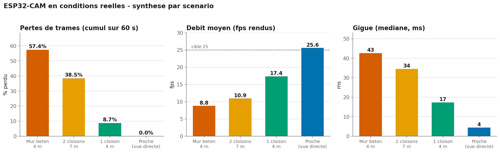
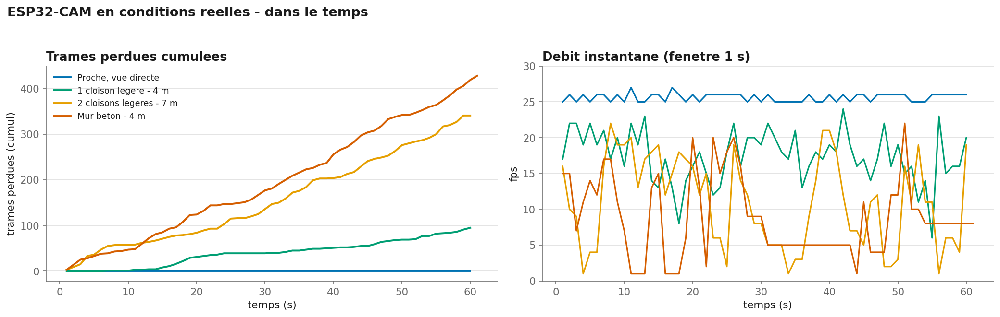

**English** · [Français](real-conditions.fr.md)

# Report — ESP32-CAM under real-world conditions (Part 2)

After the **synthetic** bench (loopback, `benchmark.en.md`) that compared receiver
architectures without ever showing any loss, this part measures the system **over a real
radio link**: a real ESP32-CAM board, a real camera, real WiFi.

## Setup

- **Transmitter**: ESP32-CAM (AI-Thinker), OV2640 sensor, **QVGA** JPEG (320×240),
  quality 12, target frame rate **25 fps**. `WiFi.setSleep(false)` (see below). Powered by
  a **power bank** → free to move around.
- **Receiver**: a **stationary** PC, right next to the AP, headless receiver `./receiver 9000
  --csv …`. Logs **one line per second**: `t, fps, jitter, completes, lost, corrupted`
  (**raw cumulative counters** → rates computed during analysis).
- **Network**: a **2.4 GHz** hotspot. With the PC staying close to the AP (a stable, fixed
  link), the only link that varies is **ESP32 ↔ AP** — so we really do vary a single factor
  by moving the ESP32.
- **4 scenarios**, ~60 s each, played back to back (comparable RF environment).

## Results

| Scenario | Avg fps | Loss (60 s cumulative) | Median jitter | Corruption |
|---|---:|---:|---:|---:|
| Close, line of sight | 25.6 | **0.0%** (0 / 1501) | 4 ms | 0 |
| 1 light partition · 4 m | 17.4 | **8.7%** (95 / 1087) | 17 ms | 0 |
| 2 light partitions · 7 m | 10.9 | **38.5%** (341 / 886) | 34 ms | 0 |
| Concrete wall · 4 m | 8.8 | **57.4%** (428 / 746) | 43 ms | 0 |

## What this shows

**1. In line of sight, the link is perfect — and identical to the bench.** 0% loss,
25.6 fps (the target rate), ~4 ms jitter. The full pipeline (capture → JPEG → UDP
fragmentation → reassembly → decoding → display) holds real time without a hitch. So the
synthetic bench hadn't lied: with a perfect link, everything gets through.

**2. Obstacles reveal the impairment the bench never showed.** Over loopback, loss and
jitter were ~0 by construction. Over the air, as soon as a wall gets in the way: loss
climbs, jitter explodes, fps collapses. That's **the whole point of Part 2** — moving from
"it works in the lab" to "here's how it degrades in real life", with numbers.

**3. The degradation is monotonic, and the material dominates.** Close 0% → 1 partition
8.7% → 2 partitions 38.5% → **concrete 57.4%**. A single concrete wall does more damage
than two light partitions farther away: at 2.4 GHz, it's **material attenuation** that
rules, not distance alone. Beyond ~40% loss, the stream becomes unwatchable (prolonged
freezes visible on the concrete curve: fps dropping to 1, loss climbing continuously).

**4. Corruption = 0 everywhere — and that's instructive.** We **never** see a corrupted
frame accepted: only **losses** (entire datagrams missing). The reason is beneath us: the
WiFi link layer has its own **FCS** and **discards corrupted radio frames** before they
reach us. At our application level, a degraded link therefore translates into *disappearing*
packets, not *wrong bytes*. Our application-level CRC32 remains a justified **safety net**
(a corrupted-but-accepted datagram isn't impossible), but in practice the air almost never
hands us one.

**5. Jitter: tuned upstream.** First observation under real conditions: ~120 ms of jitter,
caused by the ESP32's **modem power-save** (bursty delivery). `WiFi.setSleep(false)`
collapsed it. All the measurements above are with power-save **disabled**; the residual
jitter then tracks link quality (spikes when frames stall).

## Limitations & method

- **2.4 GHz, uncontrolled RF neighborhood**: absolute values depend on the day's
  environment; it's the **differences between scenarios** that matter.
- `loss %` = cumulative over the whole run (the raw counters allow recomputing a per-second
  rate if needed).
- **RSSI not logged** (it was only output on the ESP32 side) → a path for improvement:
  carry it up in the stream to correlate dBm ↔ loss.
- **Absolute latency** deliberately absent (ESP/PC clocks not synchronized): only fps,
  jitter, and loss are reliable.
- Two measurement files (`02_…` / `03_…`) had their **names swapped** at capture time; the
  physical labels were restored during analysis (data unchanged).

## Conclusion

The project is complete end to end: a homemade UDP protocol → asio receiver → adaptive
upscaling → **real-time Qt dashboard**, validated from the synthetic bench all the way to a
**real ESP32 over WiFi**. The dashboard displays live exactly what this report measures; the
characterization above gives the link's real-world limits (a concrete wall breaks the stream,
a line-of-sight view holds 25 fps without loss).
